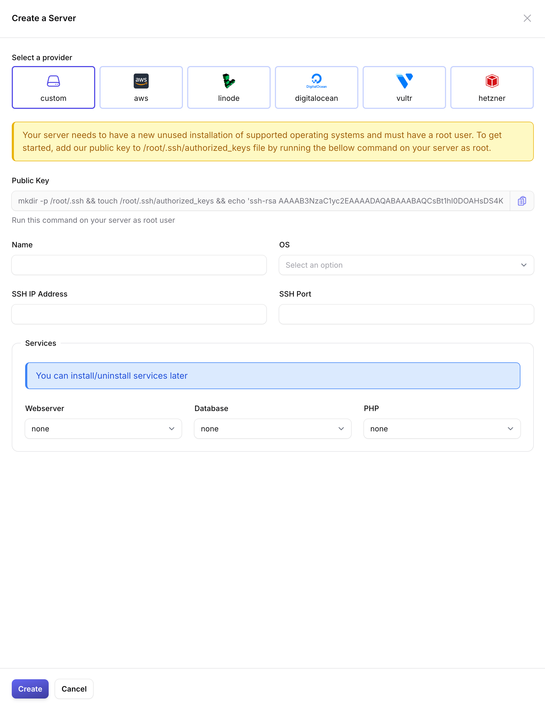
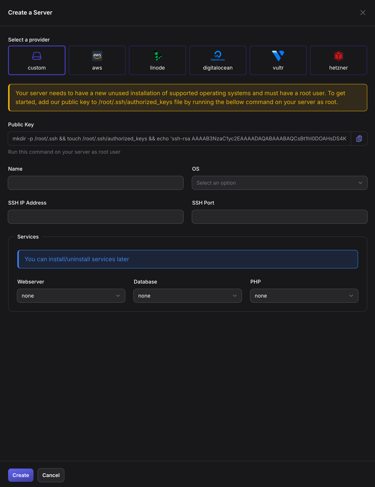
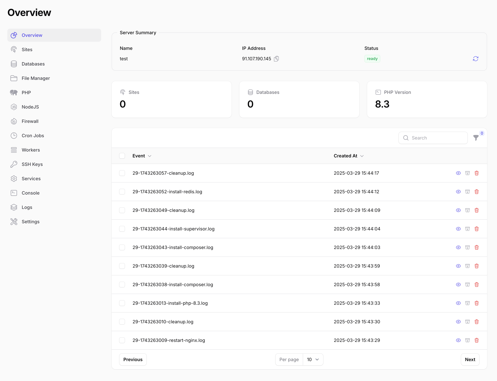
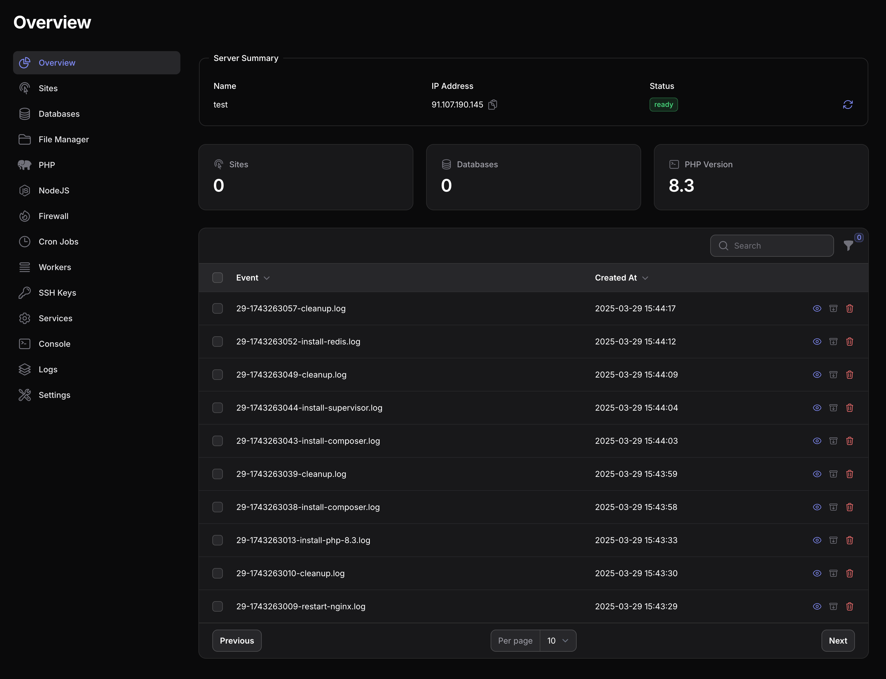

In order to manage your server with VitoDeploy and deploy your applications, you need to create a server with Vito. In this post, I will show you how to create a server with VitoDeploy.

{/* truncate */}

## Create a server

To create a server, Simply navigate to the `/servers` of your Vito instance and click on the **Create Server** button. You will see a modal like the following screenshot:

Fill the basic information about the server and continue.

## Custom Server vs Cloud Providers

Vito supports a few cloud providers like AWS, DigitalOcean, Vultr, Linode, and Hetzner to create server on them. Howeverm, you can use Vito to provision a server on a provider of your own choice.

:::info
The only difference is that you need to grant Vito access to your server by adding Vito's public SSH key to your server.
:::

## Which OS to choose?

Vito only supports Ubuntu's latest versions. I recommend you to use the latest version that Vito shows you in the dropdown list.

## Which services to install?

Vito is a service oriented platform. It means that you can install the services that you need on your server. For example, if you are going to deploy a Laravel application, you need to install Webserver, Database (optional), and PHP. However, if you are going to deploy a WordPress application, you need to install Webserver and MySQL.

You have the option to install the services you need in the server creation step or you can install them later.

:::tip
You can always install or uninstall the services later. So, you can skip them in the installation step for faster provisioning.
:::

## Installation Finished

Once you click on the **Create Server** button, Vito will start creating your server. You can see the progress in the installation page. Once the server is created, you will land in the server overview page.

